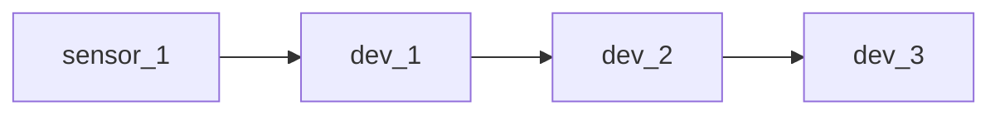
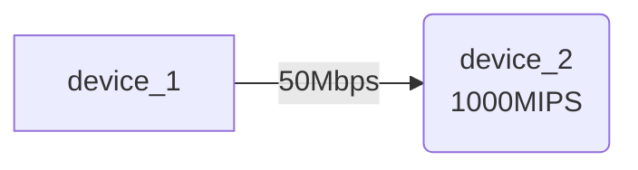
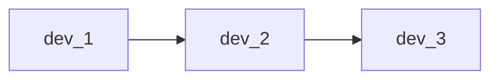
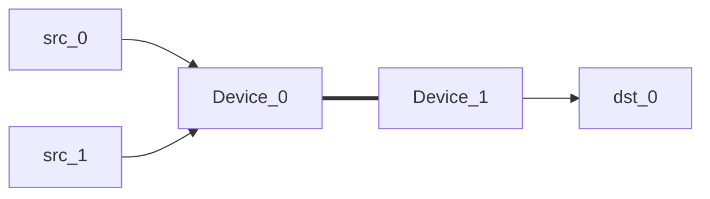

# 1. Scenarios 1hop

## Platforme

## 1.1 1hop-net
- network >> cpu
- netowrk flow size: 100Mb = 2s par message
- exec size: 500MIPS = 0.5s par exec
- 1 CPU core
- nbReq: De 1 à 10 lancées en meme temps
- **scheduling interval: 10**

## 1.2 1hop-exec

- cpu >> network
- netowrk flow size: 25Mb = 0.5s par message
- exec size: 1000MIPS = 1s par exec
- 1 CPU core
- nbReq: De 1 à 10 lancées en meme temps
- **scheduling interval: 10**
**COMMENTAIRE: comms ok, mais je ne comprends rien aux execs IFS, scheduling interval qui fait tout déconner en plus**

## 1.3 1hop-latency

**todo**

# 2. Scenarios 2hops

## 2.1 2hops-net
- network >> cpu
- netowrk flow size: 100Mb = 2s par message
- exec size: 500MIPS = 0.5s par exec
- 1 CPU core
- nbReq: De 1 à 10 lancées en meme temps
- **scheduling interval: 10**

## 2.2 2hops-exec

- cpu >> network
- netowrk flow size: 25Mb = 0.5s par message
- exec size: 1000MIPS = 1s par exec
- 1 CPU core
- nbReq: De 1 à 10 lancées en meme temps
- **scheduling interval: 10**

## 2.3 2hops-lat
- cpu = 8s/req
- flow size: 50Mb = 1s/req
- lat: {0, 50, 100}ms
- nbReq: de 1 à 5

# 3. Semi-Dogbone :)

- bwsrc0="50" #Mbps
- bwsrc1="50" #Mbps
- bwdev="100 50 25" #Mbps
- bwdst="50" #Mbps
- latsrc0=0
- latsrc1=0
- latdev=$(seq 0 10 51)
- latdst=0
- flowSize="6250000 12500000 18750000" # MB
- execCost=500 # MIPS